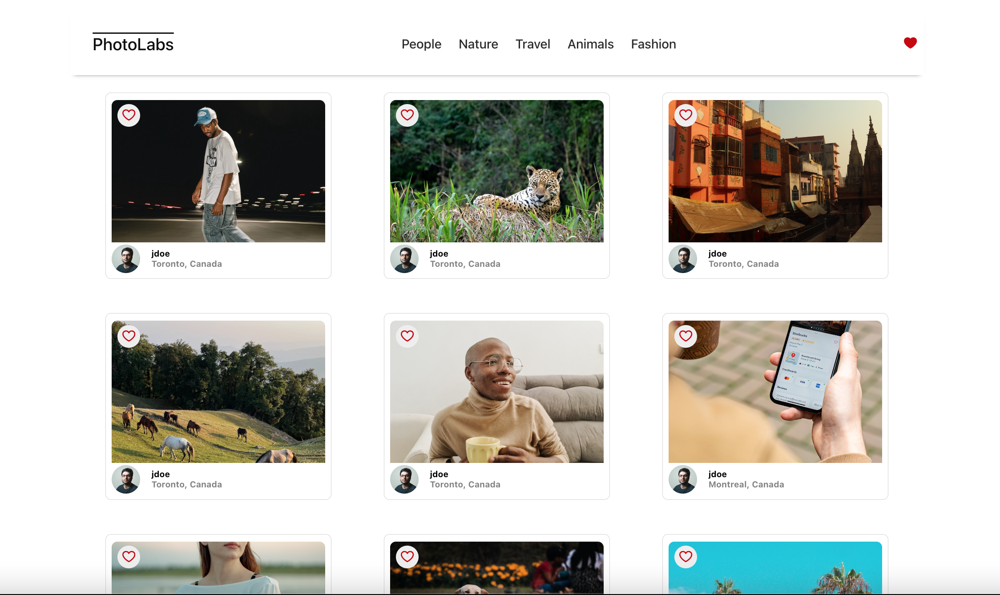
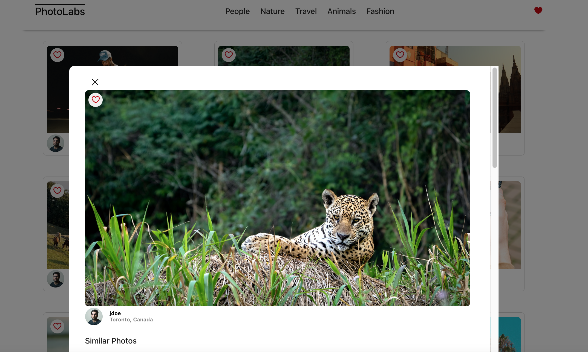
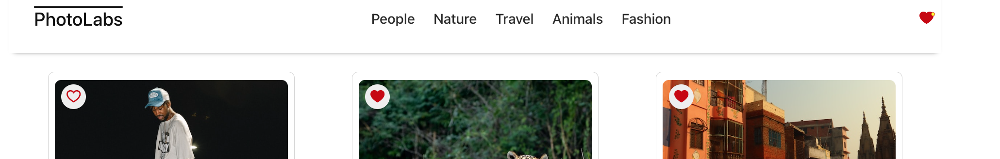

### react-photolabs
Please note the PhotoLabs project for the Web Development React course programming run by Lighthouse Labs.

# Photolabs
Photolabs is a react app which allows a user to view a list of photos and interact with them. 

## Screenshots

### Photolabs home page


### Photo Modal


### Photos Favourited


## Using Photolabs

### Navigating Photos
You can view all photos in the database on the home page, or select a topic to view photos of only that specific topic. If you wish to view all photos again you simply can click on the PhotoLabs logo on the left side of the navbar to return to the home page.

### Viewing indivudal Photos
To view an individual photo a user can click on the photo to open a modal. The modal will display a larger version of the photo along with the photo details, and similar photos.

### Favourite Photos
Every photo has a heart icon on the top left in the photo lists, and photo modal. Clicking this heart will favourite the photo. The state of the favourite button will appear red when a photo is favourited in all places where the photo is displayed. The top right heart of the navigation bar will display a notification of a yellow dot to inform the user they have photos selected as favourites.

## Setup Photolabs

Install dependencies with `npm install` in each respective `/frontend` and `/backend`.

## [Frontend] Running Webpack Development Server

```sh
cd frontend
npm start
```

## [Backend] Running Backend Servier

Read `backend/readme` for further setup details.

```sh
cd backend
npm start
```
